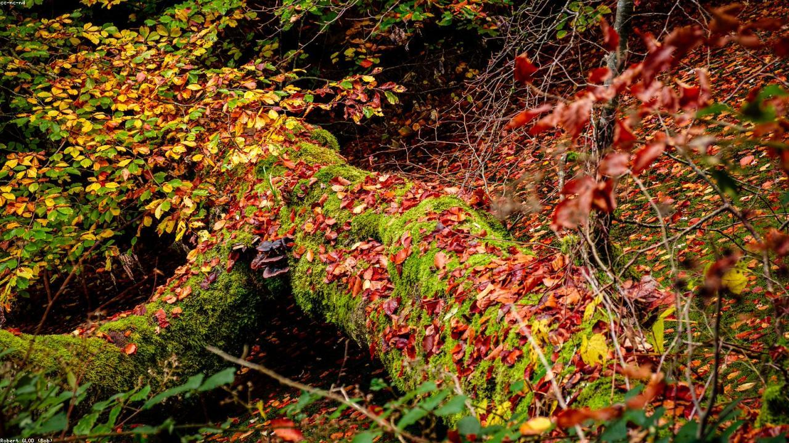
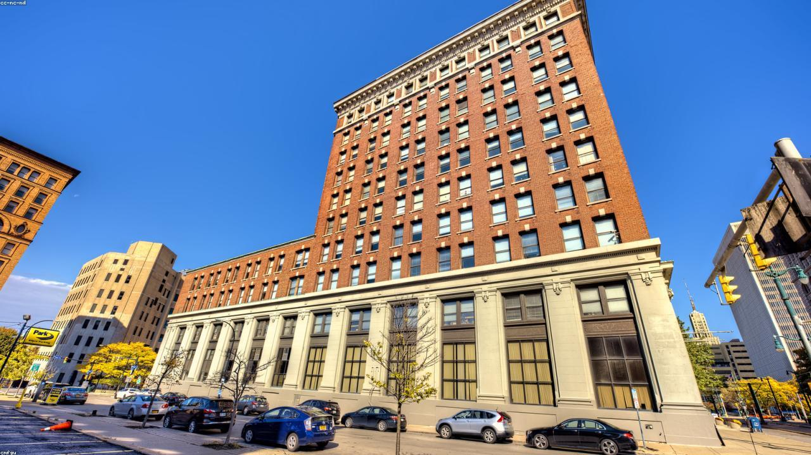

# 🌟 Advanced CSS Visual Dynamics Pro
**Cognifyz Technologies Internship - Level 3, Task 2**


A masterclass in modern front-end web development, strictly relying on **Vanilla HTML5 and CSS3**. This project pushes the boundaries of what is possible without JavaScript, featuring an automated Ken Burns slideshow, pure CSS categorical filtering, masonry layouts, and fully interactive split-pane lightboxes.

---

## 📸 Project Visuals

### Ken Burns Slideshow & Glassmorphism Header
*(The automated carousel smoothly crossfades and zooms, tracked by a CSS progress bar)*


### Masonry Grid & Pure CSS Filtering
*(Clicking the category pills instantly filters the masonry layout below)*


---

## ✨ Core Features

### 1. Interactive Pure CSS Filtering
A custom-built category filter system (**All, Nature, Cityscapes, Astrophotography**). Built utilizing hidden `<input type="radio">` tags and the CSS general sibling combinator (`~`). Filtering instantly hides/shows relevant masonry images with zero JavaScript overhead.

### 2. Automated Ken Burns Slideshow
An infinite looping image carousel that crossfades 5 majestic background images. 
- Features cinematic "Ken Burns" scale animations.
- Includes a pure CSS-animated progress bar synced flawlessly to the 5-second image intervals.

### 3. Split-Pane Lightbox Modals
A highly detailed modal overlay triggered by the `:target` CSS pseudo-class. 
- **Left Pane:** Displays the uncropped, high-resolution image.
- **Right Pane:** Scrollable area containing the photograph's story, exact real-world location, photographer name, and technical EXIF metadata (Focal Length, Aperture, ISO, Shutter Speed).

### 4. Advanced "Dark Mode" Aesthetics
- **Animated Starfield Background:** A multi-layered background featuring softly glowing orbs and twinkling radial gradients (`animation: twinkle`).
- **Glassmorphism:** A sticky navigation header with `backdrop-filter: blur(20px)` for a premium frosted glass effect.
- **Custom UI:** Sleek custom scrollbars and neon text-selection matching the primary theme colors.

---

## 🛠️ Technical Architecture

This project strictly avoids JavaScript to demonstrate advanced CSS logic:
- **State Management:** Handled via URL hash `#` (for Lightboxes) and `:checked` pseudo-classes (for Filters).
- **Layouts:** `column-count` is utilized to create the dynamic Masonry grid. Flexbox and Grid are used for micro-layouts within the lightboxes.
- **Performance:** All images are locally hosted physical files (`images/` directory) generated specifically to fit the layout without external CDN latency.

---

## 📂 Folder Structure

```text
📦 Level 3_Task 2
 ┣ 📂 images/                     # 32 Physical localized image assets
 ┃ ┣ 📜 canyon_600x800_5.jpg
 ┃ ┣ 📜 cherryblossom_900x1600_30.jpg
 ┃ ┗ 📜 ... (and 30 more)
 ┣ 📜 index.html                  # Semantic HTML & CSS Logic Hooks
 ┣ 📜 style.css                   # The powerhouse driving animations & layout
 ┗ 📜 README.md                   # Project documentation
```

---

## 🚀 How to Run

Because this project uses entirely local assets and vanilla web technologies, there is no build step required.

1. Clone or download this repository.
2. Navigate to the project folder.
3. Simply double-click `index.html` to open it in your preferred web browser.

---

*Developed as part of the **Cognifyz Technologies Web Development Internship**.*
